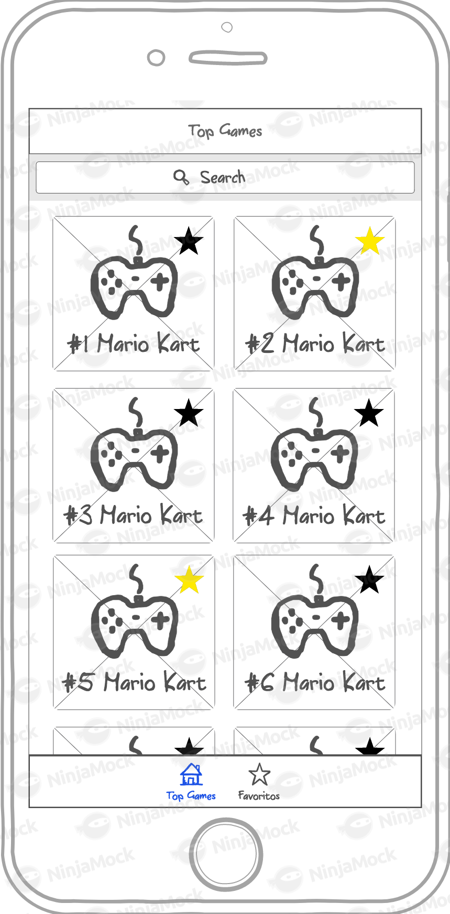
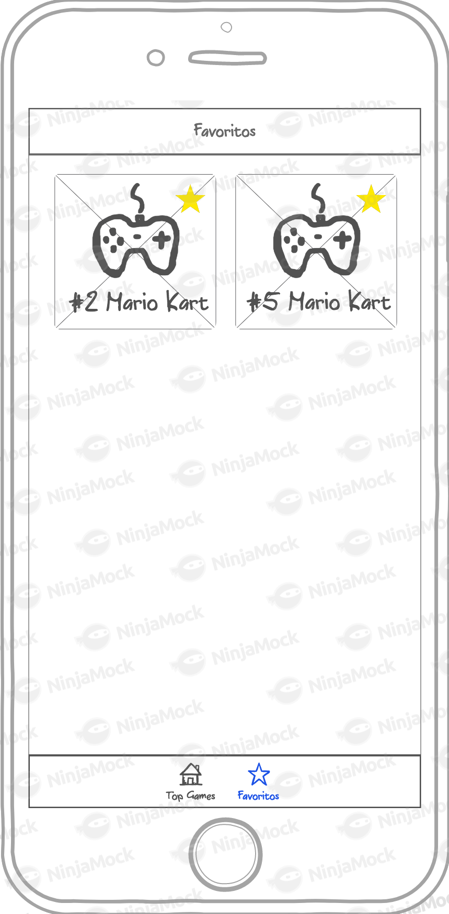
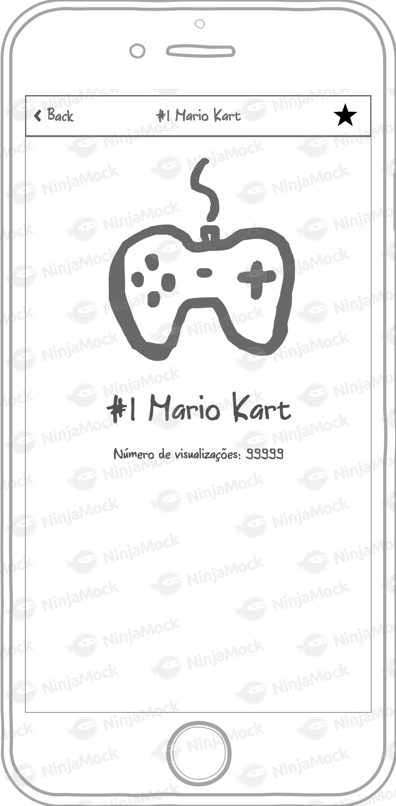

# Desafio - Desenvolvedor iOS

Nós do time de iOS da Farfetch Brasil gostamos de jogar videogames. O objetivo do teste é implementar um app onde podemos ver os **jogos com mais visualizações no Twitch**. 🤓🎮

## API

Para desenvolver o app você vai precisar usar o endpoint de Top Games do Twitch. Mais informações: https://dev.twitch.tv/docs/api/reference/#get-top-games.

Para esse endpoint, use o Client-ID:

**xzqsdxt247xi72kder6l57r0aksbsh**

## Interface

A interface do app é dividida em 3 partes e deve ser desenvolvida conforme os pontos abaixo.

### Home - Top Games

* Listagem dos jogos ordenados por visualização.
* Botão para favoritar jogos nas células.
* Paginação na lista: Carregar 20 jogos por vez, baixando a próxima página ao chegar no fim da lista.

### Detalhes do jogo

* Botão de favorito.
* Foto em tamanho maior, nome e número de visualizações do jogo.

### Favoritos

* Listagem dos jogos favoritados pelo usuário.
* Favoritos devem ser persistidos para serem acessados offline.
* Interface de lista vazia caso o usuário não tenha favoritos.

### Wireframe

Abaixo temos os wireframes das telas do app.

Se você pensou em alguma *killer feature* que acabamos deixando de fora do nosso backlog, sinta-se a vontade para implementar. **Use sua imaginação!** 🤓

|   |  |  |
|:---:|:---:|:---:|
| Lista de Top Games | Jogos Favoritos | Detalhes do Jogo |

## Requisitos Essenciais

* Today Widget: Um Widget onde podemos visualizar rapidamente os 3 jogos mais populares do Twitch.
* Persistir os favoritos salvos para que possamos acessá-los offline.
* **O teste não pode apresentar crashes.**

**A falta de algum requisito essencial é eliminatória.**

## Observações

* Você pode utilizar bibliotecas de terceiros e gerenciadores de dependências (CocoaPods, Carthage, etc) como preferir.
